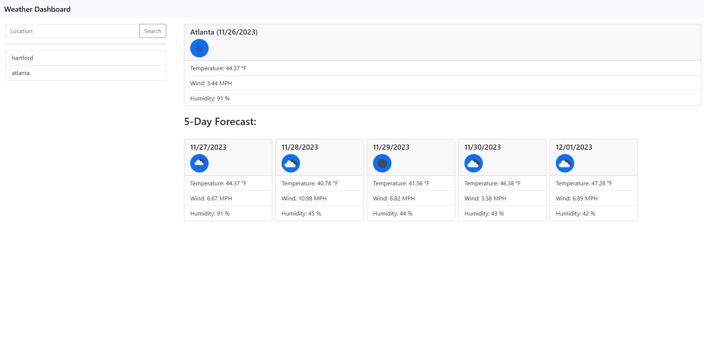

# Weather Dashboard

## Description

This is a weather dashboard allowing you to search cities and view current and 5-day forecast for it.

- The application is designed to be responsive and user-friendly.
- Recent Searches are stored in the browser's local storage.

## Technologies Used

- HTML
- CSS
- JavaScript

### APIS

- JQuery
- Bootstrap
- OpenWeatherMap

## How-to Use

You can use it at: <https://bskor66.github.io/Weather-Dashboard/>

Search any city to begin!

## Screenshot

## License

This project is open-source and available under the [MIT License](LICENSE).
